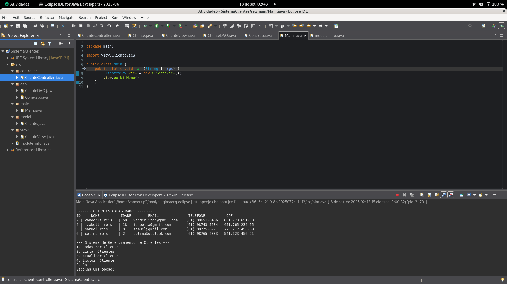

# 🧾 Sistema de Gerenciamento de Clientes - Java MVC

Este projeto é uma aplicação Java que implementa o padrão arquitetural **MVC (Model-View-Controller)**, com persistência de dados em banco MySQL. O sistema permite **cadastrar, listar, atualizar e excluir clientes**, utilizando uma estrutura modular e organizada.

---

## 🧠 Arquitetura MVC

O projeto está dividido em cinco pacotes principais:

| Pacote      | Responsabilidade                                                                 |
|-------------|-----------------------------------------------------------------------------------|
| `model`     | Representa os dados da aplicação (ex: classe `Cliente`)                          |
| `view`      | Interface com o usuário via terminal (entrada e saída de dados)                  |
| `controller`| Lógica de negócio e validações                                                   |
| `dao`       | Acesso ao banco de dados (CRUD via JDBC)                                         |
| `main`      | Ponto de entrada da aplicação (`Main.java`)                                      |

---

## 📦 Estrutura de Classes

### 🔹 `model.Cliente`
Classe que representa a entidade Cliente, com atributos encapsulados:
- `id`, `nome`, `idade`, `email`, `telefone`, `cpf`
- Construtores, getters e setters

### 🔹 `controller.ClienteController`
Controla a lógica de negócio:
- Valida dados antes de persistir
- Chama métodos do DAO
- Exibe mensagens de sucesso/erro

### 🔹 `view.ClienteView`
Interface via terminal:
- Menu interativo
- Entrada de dados via `Scanner`
- Chama métodos do controller

### 🔹 `dao.ClienteDAO`
Responsável pelas operações com o banco:
- `inserir`, `listar`, `atualizar`, `excluir`
- Utiliza `PreparedStatement` e `ResultSet`

### 🔹 `dao.Conexao`
Classe utilitária para conectar ao banco MySQL:
```java
URL: jdbc:mysql://172.16.9.xxx:3306/clientes_db
Usuário: root
Senha: ----

## Estrutura do Banco de Dados
[vander@localhost ~]$ sudo ssh sshuser@172.16.9.133
sshuser@172.16.9.133's password: 
Welcome to Ubuntu 24.04.3 LTS (GNU/Linux 6.14.0-29-generic x86_64)

 * Documentation:  https://help.ubuntu.com
 * Management:     https://landscape.canonical.com
 * Support:        https://ubuntu.com/pro

Manutenção de Segurança Expandida para Applications não está ativa.

6 as atualizações podem ser aplicadas imediatamente.
Para ver as actualizações adicionais corre o comando: apt list --upgradable

Ativar ESM Apps para poder receber possiveis futuras atualizações de segurança.
Consulte https://ubuntu.com/esm ou execute: sudo pro status

Last login: Thu Sep 18 02:25:43 2025 from 172.16.9.1
sshuser@ubuntu25:~$ su
Senha: 
root@ubuntu25:/home/sshuser# mysql -u root -p
Enter password: 
Welcome to the MySQL monitor.  Commands end with ; or \g.
Your MySQL connection id is 8
Server version: 8.0.43-0ubuntu0.24.04.1 (Ubuntu)

Copyright (c) 2000, 2025, Oracle and/or its affiliates.

Oracle is a registered trademark of Oracle Corporation and/or its
affiliates. Other names may be trademarks of their respective
owners.

Type 'help;' or '\h' for help. Type '\c' to clear the current input statement.
mysql> show databases;
+--------------------+
| Database           |
+--------------------+
| cadastro_db        |
| clientes_db        |
| information_schema |
| mysql              |
| performance_schema |
| sys                |
+--------------------+
6 rows in set (0,03 sec)

mysql> use clientes_db;
Reading table information for completion of table and column names
You can turn off this feature to get a quicker startup with -A

Database changed
mysql> show tables;
+-----------------------+
| Tables_in_clientes_db |
+-----------------------+
| clientes              |
+-----------------------+
1 row in set (0,00 sec)
mysql> describe clientes;
+----------+--------------+------+-----+---------+----------------+
| Field    | Type         | Null | Key | Default | Extra          |
+----------+--------------+------+-----+---------+----------------+
| id       | int          | NO   | PRI | NULL    | auto_increment |
| nome     | varchar(100) | NO   |     | NULL    |                |
| idade    | int          | YES  |     | NULL    |                |
| email    | varchar(100) | NO   |     | NULL    |                |
| telefone | varchar(20)  | YES  |     | NULL    |                |
| cpf      | varchar(16)  | YES  |     | NULL    |                |
+----------+--------------+------+-----+---------+----------------+
6 rows in set (0,01 sec)

mysql> select * from clientes;
+----+---------------+-------+-----------------------+-----------------+----------------+
| id | nome          | idade | email                 | telefone        | cpf            |
+----+---------------+-------+-----------------------+-----------------+----------------+
|  2 | vanderli reis |    50 | vanderlitec@gmail.com | (61) 98651-6466 | 601.773.651-53 |
|  4 | izabella reis |    18 | izabella@gmail.com    | (61) 98743-5534 | 451.765.234-55 |
|  5 | samuel reis   |     9 | samuel@gmail.com      | (61) 98775-6771 | 773.212.456-89 |
|  6 | celina reis   |     2 | celina@outlook.com    | (61) 98765-2333 | 541.123.456-21 |
+----+---------------+-------+-----------------------+-----------------+----------------+
4 rows in set (0,00 sec)

## Listando dados através da IDE Eclipse


https://github.com/user-attachments/assets/71d12dfa-5088-4394-88db-22cd701b34ae

